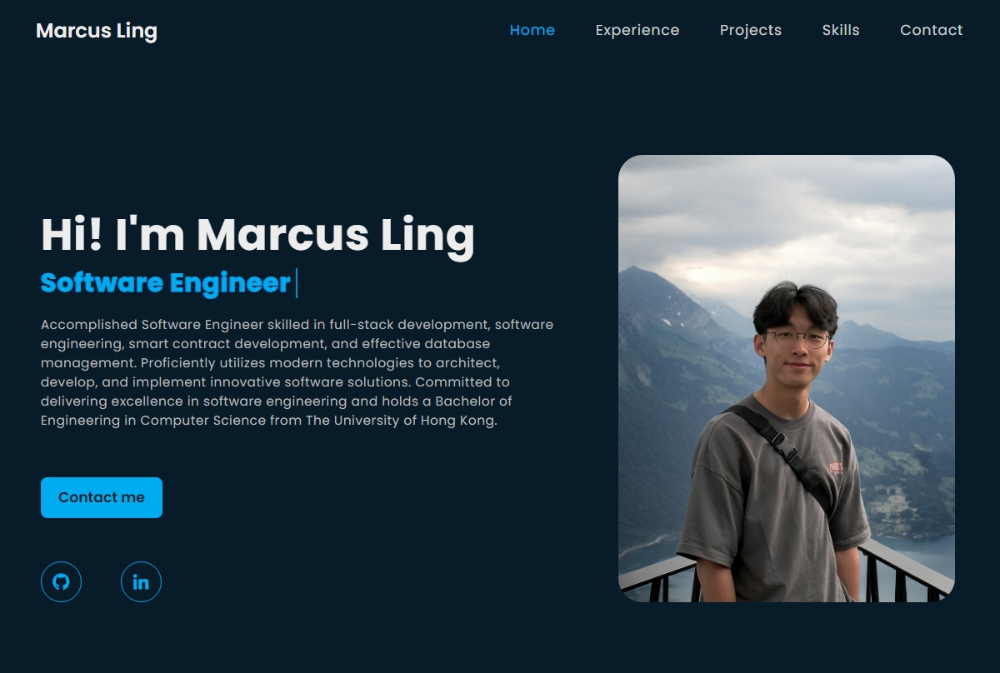

# Portfolio Website

## Description

This project is a single-page portfolio website designed to showcase my skills, projects, and experiences as a software engineer. It serves as a central platform for demonstrating my capabilities in a visually engaging manner to potential employers, clients, or collaborators.

## Features

- **Responsive Design**: Built with Bootstrap for a responsive layout that looks great on all devices.
- **Navigation**: Easy navigation between different sections of the website using React Router.
- **Email Functionality**: Integrated with EmailJS for handling inquiries directly from the website.
- **Interactive Elements**: Utilizes FontAwesome for icons and MUI for additional UI components to enhance the user interface.
- **Project Showcase**: A dedicated section to display my projects 

## Getting Started

To run this project locally, follow these steps:

### Prerequisites

Ensure you have Node.js installed on your system. You can download it from [Node.js official website](https://nodejs.org).

### Installation

1. Clone the repository to your local machine.
2. Navigate to the project directory.
3. Install the necessary dependencies by running: `npm install`
4. Start the development server: `npm start`

Now, open your browser and go to `http://localhost:3000` to view the portfolio.

## Contributing

Contributions are welcome If you find a bug or want to add a feature, please submit an issue or fork the repository and submit a pull request.